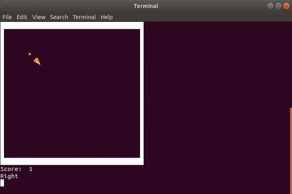

# Snake-In-Py
  
    
    
    
    
  
 
 

> This snake can find food in map
 
<b>Windows</b>
 
  You should clone the 'windows' branch:
  <pre>https://github.com/AliRn76/Snake-In-Py.git -b windows</pre>
  
  or use this link to download it as zip :
  https://codeload.github.com/AliRn76/Snake-In-Py/zip/windows
   
   
<b>Linux</b>
 
Just Clone, And Enjoy It :)
<pre>https://github.com/AliRn76/Snake-In-Py.git</pre>
 
<b>Demo:</b>

